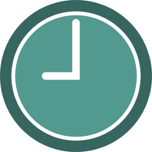

   
 

 
 
<h2 align="left"> About me</h2>

 
 

Motivated Frontend Developer with a passion for coding and attention to detail. Committed to creating clean, elegant code, I excel at combining creativity with technical expertise. I am an active member of IT communities and founder of a group supporting women in IT,  have experience teaching students of all ages and a knack for creating compelling teaching materials. 

 
 

- 💻 Working on Javascript, ReactJS, Node.js
- 🔭 I’m currently working on completing an app to memorise English words
- 🌱 I’m currently completing my study of React
- 👯 I’m looking to collaborate on awesome web development projects. (Front-end preferably)
- 🤔 I’m looking for a job in the EU remotely with the possibility of relocation
- 💬 Ask me about IT technology, modular synthesis, design, sketching, classical or electronic music
- ⚡ Fun fact: human brain capacity exceeds 4 terabytes

  

<h2 align="left" id="sssheina-tech"> How to reach me</h2>

> Links to my portfolio and social media.

 
 

<table  align="center">
  <tr>
    <td align="center" width="96">
       GITHUB
     </td>
    <td align="center" width="96">
       TELEGRAM
     </td>
   <td align="center" width="96">
       LINKEDIN
     </td>
   <td align="center" width="96">
       TWITTER
     </td>
   <td align="center" width="96">
       CODEPEN
     </td>
   <td align="center" width="96">
       BEHANCE
     </td>
   
   </tr>
</table>

 
 

<h2 align="left" id="sssheina-tech"> Profile statistics</h2>  

  
  
  
   
  

 

<h2 align="left" id="sssheina-tech"> Favorite Tech</h2>

> Tools, languages, and other things that I like to work with.

 
 
<table  align="center">
  <tr>
    <td align="center" width="96">
      
       REACT
    </td>
    <td align="center" width="96">
      
       REDUX
    </td>
    <td align="center" width="96">
      
       JS
    </td>
    <td align="center" width="96">
      
       SASS
    </td>
    <td align="center" width="96">
      
       CSS3
    </td>
    <td align="center" width="96">
      
       HTML5
    </td>
    <td align="center"  width="96">
      
       BEM
    </td>
    <td align="center" width="96">
      
       GIT
    </td>
    <td align="center" width="96">
      
       BOOTSTRAP
    </td>
    <td align="center" width="96">
      
       NPM
    </td>
  </tr>
  <tr>
    <td align="center" width="96"> 
      
       GITHUB
    </td>
    <td align="center" width="96">
      
       NodeJS
    </td>
   <td align="center"  width="96">
      
       WEBPACK
    </td>
   <td align="center"  width="96">
      
       CHART.JS
    </td> 
    <td align="center"  width="96">
      
       MOMENT.JS
    </td>
    <td align="center"  width="96">
      
       ANIME.JS
    </td>
   <td align="center"  width="96">
      
       VSC
    </td> 
    <td align="center"  width="96">
      
       FIGMA
    </td>
    <td align="center"  width="96">
      
       TRELLO
    </td>
    <td align="center"  width="96">
      
       AI
    </td>
    <td align="center"  width="96">
      
       PS
    </td> 
      
   
    
  </tr>
</table>

  

<h3>Thank you for visiting my profile! </h3> 🤓😜

 

 

 
  

 
 
 
 

